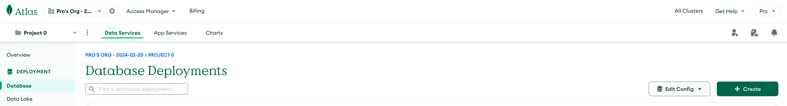
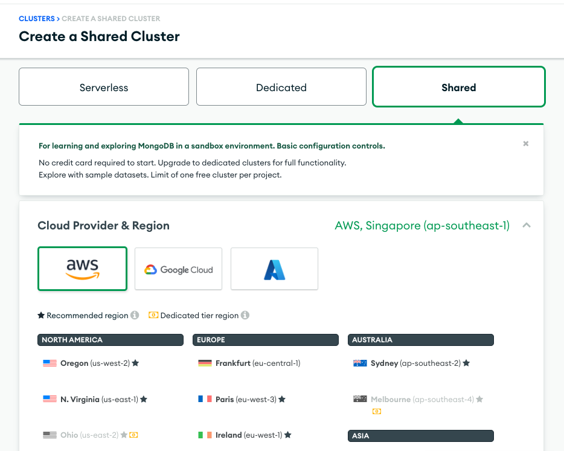
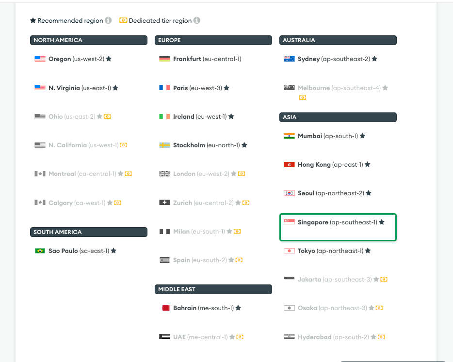
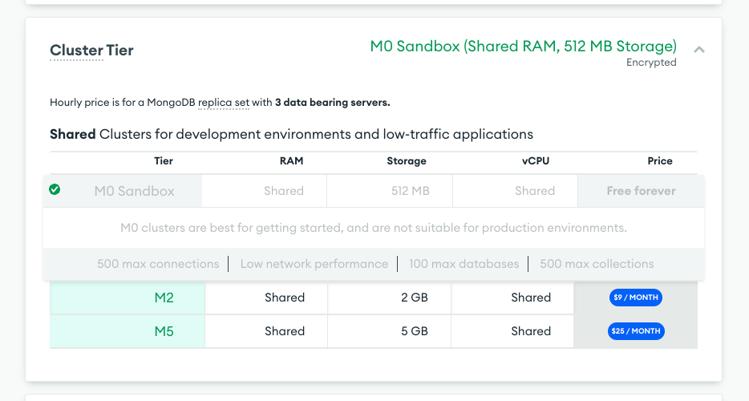
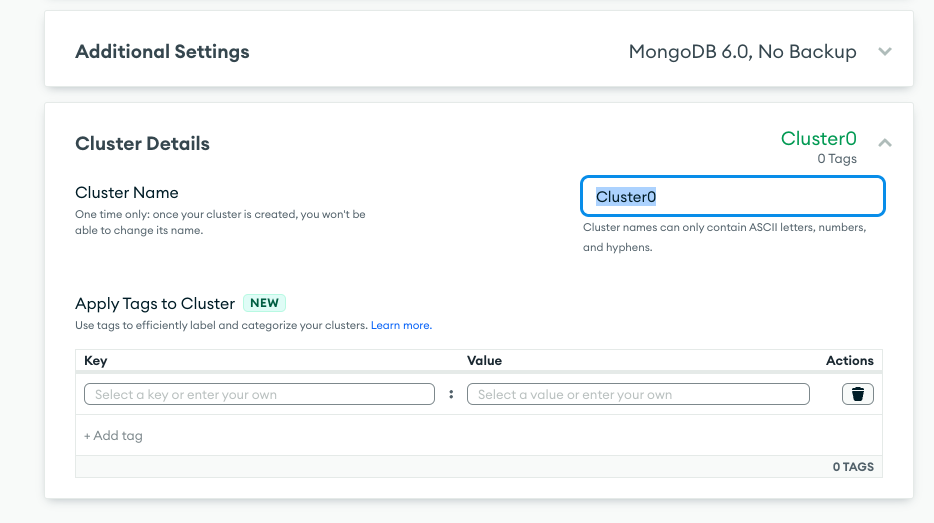
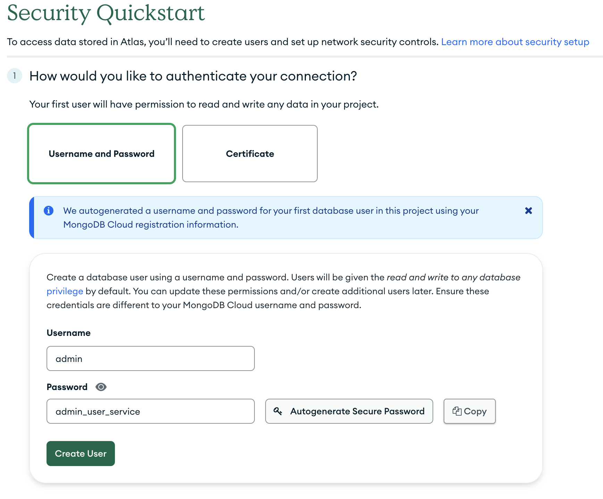
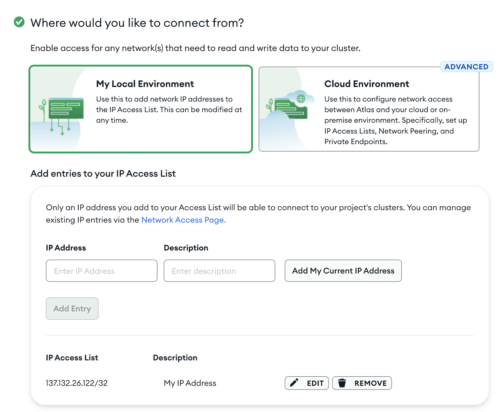
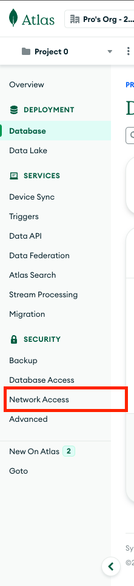
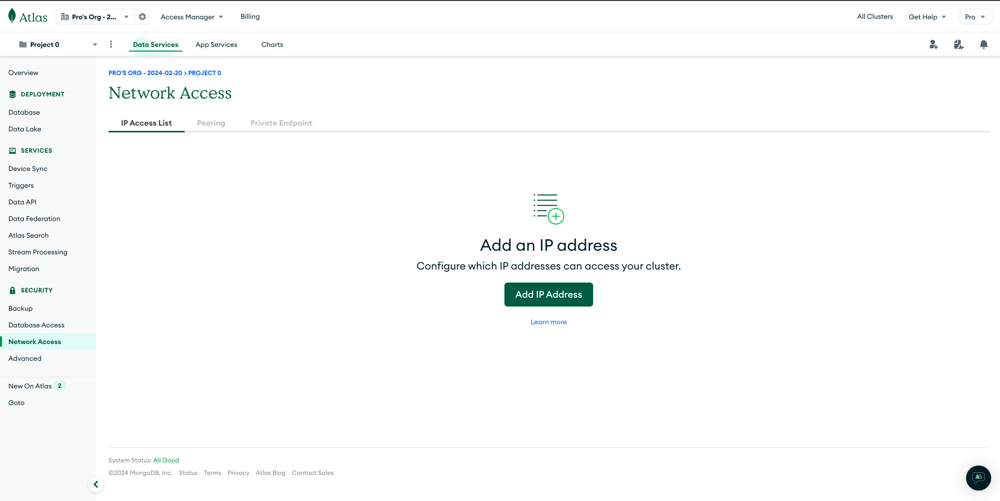
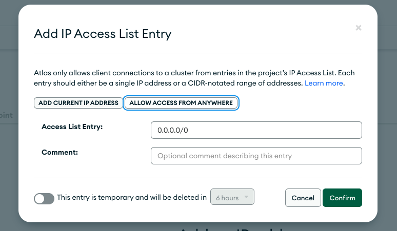

# Setting up MongoDB Instance for User Service

1. Visit the MongoDB Atlas Site [https://www.mongodb.com/atlas](https://www.mongodb.com/atlas) and click on "Try Free"

2. Sign Up/Sign In with your preferred method.

3. You will be greeted with welcome screens. Feel free to skip them till you reach the Dashboard page.

4. Create a Database Deployment by clicking on the green `+ Create` Button:

5. Make selections as followings:

- Select Shared Cluster
- Select `aws` as Provider

- Select `Singapore` for Region

- Select `M0 Sandbox` Cluster (Free Forever - No Card Required)

> Ensure to select M0 Sandbox, else you may be prompted to enter card details and may be charged!

- Leave `Additional Settings` as it is

- Provide a suitable name to the Cluster

6. You will be prompted to set up Security for the database by providing `Username and Password`. Select that option and enter `Username` and `Password`. Please keep this safe as it will be used in User Service later on.

7. Next, click on `Add my Current IP Address`. This will whiteliste your IP address and allow you to connect to the MongoDB Database.

8. Click `Finish and Close` and the MongoDB Instance should be up and running.

## Whitelisting All IP's

1. Select `Network Access` from the left side pane on Dashboard.

2. Click on the `Add IP Address` Button

3. Select the `ALLOW ACCESS FROM ANYWHERE` Button and Click `Confirm`

Now, any IP Address can access this Database.
